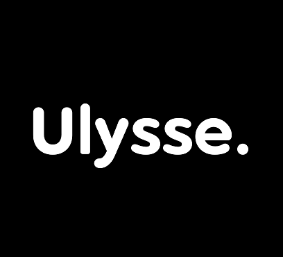

# Ulysse.

Brief description of your organization and its mission.

## Table of Contents

- [Ulysse.](#ulysse)
  - [Table of Contents](#table-of-contents)
  - [About](#about)
  - [Getting Started](#getting-started)

## About

We are a friendly group of thinkers, designers & techies constantly delivering new products that can be trusted to bring your vision to life with modern, robust solutions.

- **Mission**: We provide packaged solutions and custom engagement options for brands, ONGs, startups, small to medium scale companies and other agencies looking to white label.
- **The Culture Code**: For us, our values are more than just words. These won’t be on any test, but the come from the heart and run deep through our culture.

## Getting Started

If you want to get involved with our organization, here's how:

- **Explore Our Repositories**: Browse through our repositories to find projects that interest you.
- **Fork and Clone**: Fork the repository you want to contribute to and clone it to your local machine.
- **Set Up**: Follow the README instructions in the repository to set up the development environment.
- **Contribute**: Make your contributions, whether it's bug fixes, new features, or documentation improvements.
- **Submit a Pull Request**: When ready, submit a pull request with your changes. Our team will review it.